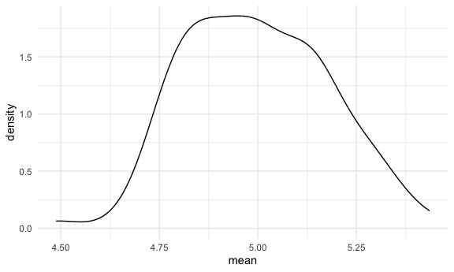
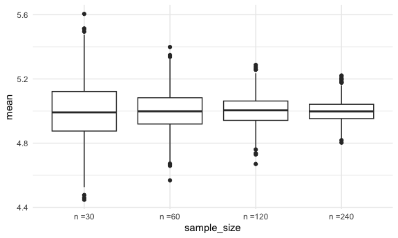

Simulations
================

Load key packages.

``` r
library(tidyverse)
```

Set seed for reproducibility.

``` r
set.seed(12345)
```

## Simulate sample mean and sd

Here’s an old function:

``` r
sim_mean_sd = function(n_obs, mu = 5 , sigma = 1) {
  
  x_vec = rnorm (n = n_obs, mean = mu, sd = sigma)

 tibble(
   mean = mean(x_vec),
   sd = sd(x_vec)
 )
  
}
```

Let’s see what this does.

``` r
sim_mean_sd(n_obs = 30)
```

    ## # A tibble: 1 × 2
    ##    mean    sd
    ##   <dbl> <dbl>
    ## 1  5.08 0.938

Let’s iterate to see how this works UNDER REPEATED SAMPLING!!!!

``` r
output = vector("list", length = 100)

for  (i in 1:100) {
  
  output[[i]] = sim_mean_sd(n_obs = 30)
  
}

sim_results =
  bind_rows(output)

sim_results |> 
  ggplot(aes(x = mean)) + geom_density()
```



``` r
sim_results |> 
  summarize(
    mu_hat = mean(mean), 
    sd_hat = sd(mean)
  )
```

    ## # A tibble: 1 × 2
    ##   mu_hat sd_hat
    ##    <dbl>  <dbl>
    ## 1   5.00  0.180

use a map function

``` r
sim_results_df =
  expand_grid(
    sample_size = c(30, 60, 120, 240),
    iter = 1:1000
  ) |> 
  mutate(estimate_df = map(sample_size, sim_mean_sd)) |> 
  unnest(estimate_df)

sim_results_df |> 
  mutate(
    sample_size = str_c("n =", sample_size),
    sample_size = fct_inorder(sample_size)
  ) |> 
  ggplot(aes(x = sample_size, y = mean)) +
  geom_boxplot()
```


